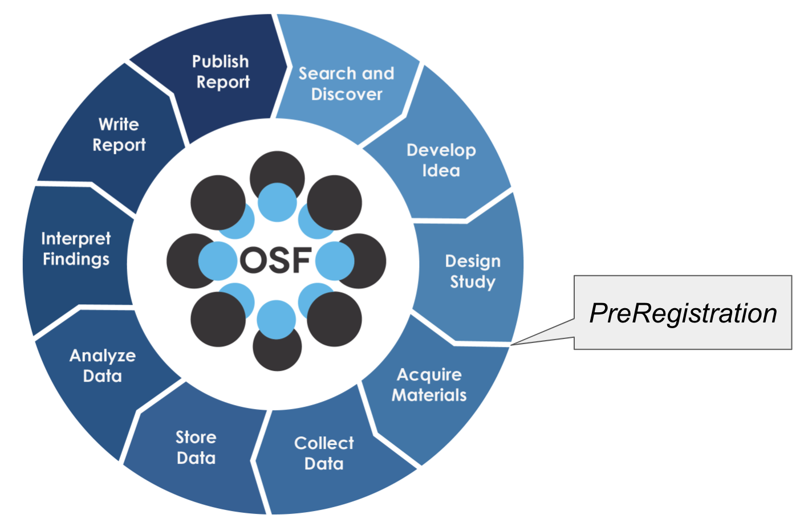
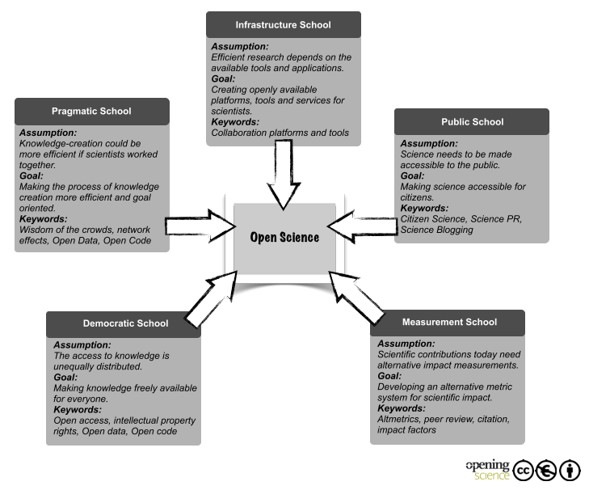

# Lesson 1: Foundations of Open Science

!!! info "Lesson Overview"
    **Duration:** 50 minutes

    **Structure:**

    - Introduction (5 min)
    - Core Concepts (25 min)
    - Hands-on Activity (15 min)
    - Wrap-up (5 min)

## Learning Objectives

!!! success "After completing this lesson, you will be able to:"
    - Define open science and explain its core components
    - Identify the six pillars of open science
    - Describe the behaviors and practices of open science
    - Explain why open science matters in education, research, and society
    - Understand both the advantages and challenges of implementing open science
    - Evaluate your own research practices against open science principles
    - Describe the 2026 US public-access and publication-cost landscape and what it means for SRP trainees

---

## Introduction (5 minutes)

### What Brings You Here?

Take a moment to reflect:

!!! question "Self-Reflection"
    - What does "open" mean to you in the context of your research?
    - Have you encountered barriers to accessing research materials you needed?
    - What concerns do you have about sharing your own work?

### Why Open Science Matters Now

In 2023 the White House declared the Year of Open Science, joined by federal agencies and over 85 universities. In 2025 the federal frame changed to "Gold Standard Science" (Executive Order 14303), and the policy details are still moving. What has not changed, and has in fact tightened, is the requirement itself: zero-embargo public access to accepted manuscripts is now live at six federal agencies, including NIH.

Open science is not just an ideological movement - it is a condition of funding:

- **Federal funders** require data management and sharing plans *and* immediate public access to accepted manuscripts
- **Publishers** increasingly require data and code availability, and increasingly steer authors toward paid open-access routes
- **Universities** are recognizing open practices in promotion and tenure
- **The public** expects access to publicly-funded research, and communities near contaminated sites expect it in forms they can use

!!! example "Why Open Science Matters for SRP Research"
    **Environmental Justice** - Communities in Arizona-Sonora mining towns, and the Navajo communities of Red Water Pond Road, Blue Gap-Tachee and Cameron, and the Pueblo of Laguna near the Jackpile Mine, living with the legacy of abandoned uranium mines, deserve access to research about contamination affecting their health

    **Reproducibility** - Toxicology studies on arsenic exposure, and on uranium, arsenic and vanadium (U/As/V) mixtures, must be reproducible to inform public health policy

    **Two centers, one shared problem** - The University of Arizona DUST Center ("Hazardous Dust in Drylands - Exposure, Health Impacts, and Mitigation") and the UNM METALS Center ("Metal Exposure and Toxicity Assessment on Tribal Lands in the Southwest") both study inhaled mine dust; transparent protocols and data sharing let their results be compared

    **NIH Requirements** - Superfund Research Program grants require data management and sharing plans, and every accepted manuscript must be deposited in PubMed Central at acceptance

    **Community Trust** - Data collected with tribal partners are governed under the CARE Principles and community review; openness that ignores that authority destroys the trust the research depends on

    **Public Health Impact** - Findings about mine tailings dust exposure and lung disease must be rapidly disseminated to protect vulnerable populations

The collapsed block below is reference material for proposal writing; skim it now and return to it when you budget a paper.

??? tip "2026 policy landscape: what changed and what did not"

    **1. The 2022 OSTP "Nelson memo" is under repeal, but agency policies stay in force.** Report language attached to the January 2026 minibus put the memo under review for repeal, and the House FY2027 CJS bill asks NSF to pause. None of that has withdrawn the policies agencies already adopted. Zero-embargo public access to accepted manuscripts began:

    | Agency | Zero-embargo public access since |
    | --- | --- |
    | DOE | 1 October 2024 |
    | EPA | 2 January 2025 |
    | NIH | 1 July 2025 (NOT-OD-25-047) |
    | USGS | 31 December 2025 |
    | NSF | 22 January 2026 (NSF 26-202) |
    | USDA | 7 April 2026 |

    Follow changes on the [SPARC policy tracker](https://sparcopen.org/our-work/2022-updated-ostp-policy-guidance/){target=_blank}.

    **2. NIH: accepted manuscript to PubMed Central at acceptance, no embargo.** The [NIH Public Access Policy](https://grants.nih.gov/policy-and-compliance/policy-topics/public-access/nih-public-access-policy-overview){target=_blank} applies to manuscripts accepted on or after 1 July 2025. Depositing the free accepted manuscript satisfies it; you do not have to pay for gold open access. Springer Nature, Wiley and Elsevier nonetheless steer NIH-funded authors toward paid gold-OA routes (see the [Springer Nature federal-compliance page](https://www.springernature.com/gp/open-science/us-federal-agency-compliance){target=_blank}). Know the difference before you sign.

    **3. Publication costs: a cap is pending and pre-approval is proposed.** NIH floated caps on allowable article processing charges (APCs) in a July 2025 request for information ([NOT-OD-25-138](https://grants.nih.gov/grants/guide/notice-files/NOT-OD-25-138.html){target=_blank}); as of June 2026 none had been finalized ([STAT](https://www.statnews.com/2026/06/11/open-access-journal-fees-nature-wiley-elsevier-nih/){target=_blank}). Separately, OMB's 29 May 2026 [proposed revision of 2 CFR 200.461](https://www.federalregister.gov/documents/2026/05/29/2026-10817/regulation-for-federal-financial-assistance){target=_blank} would make APCs unallowable unless pre-approved in the award, with a target date of 1 October 2026; it was not final when this page was written ([SPARC FAQ](https://sparcopen.org/our-work/2026-proposed-2cfr200-updates-faqs/){target=_blank}). Practical consequence: **budget publication costs explicitly** in every proposal.

    **4. Gold Standard Science.** Executive Order 14303 (23 May 2025) and the 23 June 2025 OSTP guidance from Director Michael Kratsios set nine tenets that agencies must build into their science policies. The agency implementation plans mostly restate existing data-management, sharing and public-access policy ([AIP FYI](https://www.aip.org/fyi/gold-standard-science-plans-emphasize-existing-agency-efforts){target=_blank}); first annual reports were due 1 September 2026, and OSTP published "Science: A New Golden Age" on 21 July 2026. [Critics argue](https://www.science.org/content/article/what-does-trump-s-call-gold-standard-science-really-mean){target=_blank} the framework could enable political interference in what science is funded.

    **5. Congress kept NIEHS and the SRP.** The FY2026 appropriation [rejected the proposed NIH reorganization and funds all 27 institutes and centers as structured in statute](https://jm-aq.com/congress-rejects-cuts-to-nih-increase-budget-for-fy26/){target=_blank}, so NIEHS and the Superfund Research Program were not folded into a new agency; SRP is funded at $77.1 million for FY2026 (P.L. 119-74).

    !!! quote "Primary sources"

        * [Executive Order 14303: Restoring Gold Standard Science, May 23, 2025](https://www.whitehouse.gov/presidential-actions/2025/05/restoring-gold-standard-science/){target=_blank}
        * [Fact Sheet: President Donald J. Trump is Restoring Gold Standard Science in America](https://www.whitehouse.gov/fact-sheets/2025/05/fact-sheet-president-donald-j-trump-is-restoring-gold-standard-science-in-america/){target=_blank}
        * [OSTP issues agency guidance for Gold Standard Science, June 23, 2025](https://www.whitehouse.gov/releases/2025/06/ostp-issues-agency-guidance-for-gold-standard-science/){target=_blank} and the [Kratsios memorandum (PDF)](https://www.whitehouse.gov/wp-content/uploads/2025/03/OSTP-Guidance-for-GSS-June-2025.pdf){target=_blank}
        * [NSF Gold Standard Science](https://www.nsf.gov/policies/gold-standard-science){target=_blank} and [EPA Gold Standard Science](https://www.epa.gov/scientific-leadership/gold-standard-science){target=_blank}
        * [OSTP: Science: A New Golden Age, July 21, 2026](https://www.whitehouse.gov/releases/2026/07/45470/){target=_blank}
        * [AIP FYI: scholarly publishing costs under scrutiny](https://www.aip.org/fyi/scholarly-publishing-costs-under-scrutiny-by-trump-administration){target=_blank} and [STM: OSTP to review potential repeal of the Nelson memo](https://stm-assoc.org/ostp-to-review-potential-repeal-of-nelson-memo/){target=_blank}
        * The 2025-26 federal AI executive orders and policy are covered in [Lesson 3](03-ai-ethics.md)

    !!! warning "Verify before you cite"
        This block describes the landscape as of September 2026. The OMB rule, the NIH APC cap and the Nelson memo review were all still moving. Check the primary sources and ask your program officer before relying on any of it in a proposal, a budget or a paper.

---

## Core Concepts (25 minutes)

### Defining Open Science

Multiple definitions exist, each emphasizing different aspects:

!!! quote "Key Definitions"
    **"Open Science is transparent and accessible knowledge that is shared and developed through collaborative networks"**

    — [Vincente-Saez & Martinez-Fuentes (2018)](https://doi.org/10.1016/j.jbusres.2017.12.043){target=_blank}

    **"Open Science is defined as an inclusive construct that combines various movements and practices aiming to make multilingual scientific knowledge openly available, accessible and reusable for everyone"**

    — [UNESCO](https://www.unesco.org/en/natural-sciences/open-science){target=_blank}

    **"A series of reforms that interrogate every step in the research life cycle to make it more efficient, powerful and accountable in our emerging digital society"**

    — Jeffrey Gillan

### The Research Life Cycle

Open science touches every stage of research, and each stage offers opportunities to embrace openness:

1. **Planning** - Pre-registration, open protocols
2. **Execution** - Open notebooks, transparent methods
3. **Analysis** - Reproducible workflows, version control
4. **Dissemination** - Open access publishing, data sharing

### The Six Pillars of Open Science

Open science rests on six foundational pillars:

| **:material-pillar: Open Access** | **:material-pillar: Open Data** | **:material-pillar: Open Education** |
|:-:|:-:|:-:|
| Publications freely available to all | Research data FAIR and accessible | Educational resources open to everyone |

| **:material-pillar: Open Methodology** | **:material-pillar: Open Peer Review** | **:material-pillar: Open Source** |
|:-:|:-:|:-:|
| Transparent, reproducible methods | Review process open and attributed | Software code freely available |

??? question "How Many Pillars Are There Really?"
    The number varies from [4](https://narratives.insidehighered.com/four-pillars-of-open-science/){target=_blank} to [8](https://www.ucl.ac.uk/library/research-support/open-science/8-pillars-open-science){target=_blank} depending on the framework. Some combine categories, others separate them. What matters is understanding the principles, not memorizing a number.

#### :material-pillar: Open Access Publications

<figure markdown>
  [{ width="150" target=_blank }](https://en.wikipedia.org/wiki/Open_access){target=_blank}
</figure>

!!! quote "Definition"
    "Open access is a publishing model for scholarly communication that makes research information available to readers at no cost, as opposed to the traditional subscription model"

    — [OpenAccess.nl](https://www.openaccess.nl/en/what-is-open-access){target=_blank}

**Publishing Models:**

1. **Subscription model** - Author pays little or nothing; publisher charges readers/institutions
2. **Gold Open Access model** - Author (or funder) pays an article processing charge; article is freely available. 2026 list prices ([Nature](https://www.nature.com/nature/for-authors/publishing-options){target=_blank}, [PLOS](https://plos.org/fees/){target=_blank}):
   - Nature: $12,850
   - Nature Communications: $7,350
   - Scientific Reports: $2,850
   - PLOS ONE: $2,477
3. **Diamond Open Access model** - No fees for authors or readers; journals are funded by institutions, societies or consortia. cOAlition S's 2026-2030 strategy [drops hard mandates](https://www.chemistryworld.com/news/what-next-for-open-access-as-coalition-s-scales-back-its-ambitions/4022618.article){target=_blank} and backs Diamond OA, preprints and rights retention instead

!!! tip "You do not need gold OA to comply with NIH"
    The NIH policy is satisfied by depositing the free **accepted manuscript** in PubMed Central. A $12,850 APC buys the version of record open on the publisher's site; it is not required for compliance. Decide on the merits, and put the cost in the budget.

**Article Versions:**

- **Preprint** - Pre-peer review version, freely available on preprint servers
- **Author Accepted Manuscript (AAM)** - Post-peer review, pre-typesetting; the version NIH requires in PubMed Central
- **Version of Record (VOR)** - Final published version with publisher formatting
- **Rights retention** (applies to the AAM) - A statement at submission that you keep the right to share your accepted manuscript openly, so no publisher agreement can block the PubMed Central deposit

!!! example "Preprint Repositories"
    - [arXiv](https://arxiv.org/){target=_blank} - Physics, math, computer science; an [independent nonprofit since 1 July 2026](https://blog.arxiv.org/2026/06/30/arxivs-next-chapter/){target=_blank}
    - [bioRxiv](https://www.biorxiv.org/){target=_blank} - Biology
    - [medRxiv](https://www.medrxiv.org/){target=_blank} - Health sciences (perfect for environmental health research); bioRxiv and medRxiv are run by [openRxiv](https://openrxiv.org/2025-year-in-review/){target=_blank}, an independent nonprofit since 2025
    - [EarthArXiv](https://eartharxiv.org/){target=_blank} - Earth sciences
    - [engrXiv](https://engrxiv.org/){target=_blank} - Engineering (including environmental engineering)
    - [OSF Preprints](https://osf.io/preprints/){target=_blank} - Multi-disciplinary

    **SRP Example (Arizona):** A study on arsenic-induced lung fibrosis mechanisms could be posted to medRxiv immediately after submission to a journal, allowing public health officials to access findings months before formal publication.

    **SRP Example (New Mexico):** A METALS biomonitoring study with Navajo Nation and Pueblo of Laguna partners is shared with the community and cleared under its dissemination approval *before* the preprint is released; the preprint then carries the community-agreed framing rather than the journal's.

#### :material-pillar: Open Data

!!! quote "Definition"
    "Open data and content can be freely used, modified, and shared by anyone for any purpose"

    — [The Open Definition](https://opendefinition.org/){target=_blank}

Data are the foundation of science. The **FAIR Principles** guide data management:

**Findable** - Globally unique identifiers, rich metadata, searchable registries

**Accessible** - Retrievable via standard protocols, metadata persists even when data are restricted

**Interoperable** - Standard formats and vocabularies enable data integration

**Reusable** - Clear licenses, detailed provenance, community standards

!!! warning "Public does not mean permanent"
    The [Data Rescue Project](https://www.datarescueproject.org/data-loss-report/){target=_blank} counted 3,000 to 4,000 federal datasets removed from public access since January 2025 (report of 18 August 2026). Deposit your own data in a repository with a persistent identifier; do not assume a government portal will still hold it. The NIEHS [SRP data sharing page](https://tools.niehs.nih.gov/srp/data/index.cfm){target=_blank} lists where SRP-funded datasets are deposited.

!!! warning "As Open as Possible, as Closed as Necessary"
    Not all data should be open:

    - Human health data (HIPAA regulations)
    - Endangered species locations
    - Indigenous data (see CARE Principles)
    - Data that could cause harm if misused

    The [**CARE Principles**](https://www.gida-global.org/careprinciples){target=_blank} for Indigenous Data Governance ([Carroll et al. 2020](https://datascience.codata.org/articles/dsj-2020-043){target=_blank}) emphasize:

    - **C**ollective Benefit
    - **A**uthority to Control
    - **R**esponsibility
    - **E**thics

    **SRP Context (Arizona):** Mine site locations near Tribal lands may require consultation with Indigenous communities. Biomarker data from residents near contaminated sites must protect participant privacy while enabling public health research. Precise GPS coordinates of endangered plant species used in phytoremediation studies should be aggregated or restricted.

    **SRP Context (New Mexico):** Research on the Navajo Nation requires approval from the [Navajo Nation Human Research Review Board (NNHRRB)](http://nnhrrb.navajo-nsn.gov/){target=_blank} before collection and before results are shared; data are returned to the community, and chapter-level exposure data are not released without community authority. Pueblo of Laguna partners have their own review. See the [UNM IRB guidance on research with American Indian communities](https://irb.unm.edu/library/documents/guidance/research-with-american-indian-communities.pdf){target=_blank} and the [METALS Center](https://hsc.unm.edu/pharmacy/research/areas/metals/){target=_blank} Community Engagement Core. [Lesson 2](02-data-management.md) covers this in depth.

#### :material-pillar: Open Educational Resources

<figure markdown>
  [{ width="200" target=_blank }](https://www.unesco.org/en/communication-information/open-solutions/open-educational-resources){target=_blank}
</figure>

!!! quote "Definition"
    "Open Educational Resources (OER) are learning, teaching and research materials in any format and medium that reside in the public domain or are under copyright that have been released under an open license"

    — [UNESCO](https://www.unesco.org/en/communication-information/open-solutions/open-educational-resources){target=_blank}

**Examples of OER Providers:**

- [The Carpentries](https://carpentries.org/){target=_blank} - Foundational coding and data science
- [Project Pythia](https://projectpythia.org/){target=_blank} - Geoscience Python education
- [OER Commons](https://www.oercommons.org/){target=_blank} - Multi-disciplinary resources
- [NIEHS Worker Training Program](https://www.niehs.nih.gov/careers/hazmat){target=_blank} - Environmental health and hazardous materials
- [METALS Center](https://hsc.unm.edu/pharmacy/research/areas/metals/){target=_blank} Community Engagement Core - Community-facing materials on uranium and metal-mixture exposure, developed with partner communities

!!! example "SRP Application"
    **Arizona:** Openly sharing protocols for collecting mine tailings samples, analyzing metalloid concentrations, or conducting plant uptake experiments accelerates research across Superfund sites nationwide. Creating open training materials on working safely with arsenic-contaminated dusts benefits the entire environmental health community.

    **New Mexico:** Materials that explain uranium and metal-mixture exposure in plain language, co-developed with Navajo and Pueblo of Laguna partners, return the research to the communities it came from and can be reused by other tribal communities living near abandoned mines.

#### :material-pillar: Open Methodology

!!! quote "Definition"
    "An open methodology is one which has been described in sufficient detail to allow other researchers to repeat the work and apply it elsewhere"

    — [Watson (2015)](https://doi.org/10.1186/s13059-015-0669-2){target=_blank}

**Key Practices:**

- **Code Sharing** - GitHub, GitLab for version-controlled code
- **Protocol Publishing** - Detailed methods in protocols.io, Nature Protocols
- **Pre-registration** - Documenting analysis plans before data collection

<figure markdown>
  { width="300" }
  <figcaption>Pre-registration distinguishes hypothesis-generating from hypothesis-testing research</figcaption>
</figure>

!!! tip "Why Pre-register?"
    - Prevents p-hacking and HARKing (Hypothesizing After Results are Known)
    - Separates exploratory from confirmatory research
    - Increases credibility of findings
    - Platforms: [OSF](https://osf.io/){target=_blank}, [AsPredicted](https://aspredicted.org/){target=_blank}

    **SRP Example (Arizona):** Pre-registering analysis plans for a study comparing lung injury markers between arsenic-exposed and control mice prevents selective reporting of outcomes. Documenting a phytoremediation field trial protocol before planting ensures transparent reporting of both successful and unsuccessful remediation approaches.

    **SRP Example (New Mexico):** Pre-registering the inflammation endpoints for an inhaled mine-dust study fixes the outcomes before the exposures begin. Registering a fungal-mineral bioremediation trial protocol, including the uranium immobilization metrics that count as success, means a null result is still a reportable result.

#### :material-pillar: Open Peer Review

Traditional peer review has limitations:

- Unreliable and inconsistent
- Delays and expense
- Lack of accountability
- Publication biases
- No incentives for reviewers

**Open peer review options:**

- Signed reviews (reviewers identity known)
- Published reviews (reviews public alongside paper)
- Reviewer participation (broader community involvement)
- Pre-print review (review before journal submission)

!!! example "Open Review Platforms"
    - [F1000Research](https://f1000research.com/){target=_blank} - Post-publication peer review
    - [PREreview](https://prereview.org/){target=_blank} - Preprint review, now integrated with bioRxiv and medRxiv so reviews appear alongside the preprint
    - [Sciety](https://sciety.org/){target=_blank} - Aggregates public preprint evaluations
    - [PubPeer](https://pubpeer.com/){target=_blank} - Post-publication commenting

#### :material-pillar: Open Source Software

!!! quote "Definition"
    "Open source software is code that is designed to be publicly accessible—anyone can see, modify, and distribute the code as they see fit"

    — [Red Hat](https://www.redhat.com/en/topics/open-source/what-is-open-source){target=_blank}

    Learn more: [Open Source Initiative →](https://opensource.org/){target=_blank}

Research relies on open source:

- Linux, Python, R, Git
- Scientific libraries: NumPy, SciPy, Pandas, PyTorch
- Data platforms: Jupyter, RStudio, CyVerse
- Environmental tools: QGIS (spatial analysis), OpenAir (air quality), ChemSpider (chemical structures)

<figure markdown>
  <a href="https://xkcd.com/2347/" target="_blank">{ width="400" }</a>
  <figcaption>Modern digital infrastructure relies on open source - handle with care! [XKCD](https://xkcd.com/2347/){target=_blank}</figcaption>
</figure>

!!! example "SRP Research with Open Source"
    **X-ray Spectroscopy Analysis (Arizona)** - Using open-source Python libraries (lmfit, pyFAI) to analyze synchrotron data characterizing arsenic speciation in mine tailings particulate matter

    **Metal-Mixture Speciation (New Mexico)** - The same pyFAI and lmfit workflows resolve uranium, arsenic and vanadium speciation in nanoparticulate mine waste, so both centers can compare results directly

    **Spatial Modeling** - QGIS and R packages (sf, terra) for mapping contamination dispersal patterns from mine sites across dryland ecosystems

    **Statistical Analysis** - R packages for analyzing dose-response relationships in toxicology experiments, with complete computational workflows shared on GitHub

    **Microbiome Analysis (New Mexico)** - QIIME 2 pipelines for gut immunity studies of metal-mixture exposure, with the full pipeline versioned alongside the sequence data

    **Image Analysis** - Open-source tools (CellProfiler, ImageJ) for quantifying lung tissue damage from inhalation exposure studies

### Why Do Open Science?

[Bartling & Friesike (2014)](https://doi.org/10.1007/978-3-319-00026-8){target=_blank} identified five schools of thought (motivations):

1. **Democratic** - Making scholarship freely available to everyone
2. **Pragmatic** - Improving quality through collaboration and critique
3. **Infrastructure** - Building better platforms and tools
4. **Public** - Engaging society through citizen science and clear communication
5. **Measurement** - Developing alternative impact metrics beyond journal publications

We add a sixth:

6. **Compliance** - Meeting requirements from funders and institutions

<figure markdown>
  { width="600" }
  <figcaption>The five schools of thought in Open Science show its multidisciplinary nature</figcaption>
</figure>

!!! question "Discussion: Your Motivation"
    Which school resonates with you? Are there other motivations not captured here?

---

## Hands-on Activity (15 minutes)

### Open Science Self-Assessment

Work individually or in small groups to assess your current practices:

!!! question "Assessment Questions"

    **Publications**

    1. Are your published papers freely available?
    2. Do you share preprints before peer review?
    3. Have you retained rights to distribute your work?

    **Data**

    4. Where do you store your research data?
    5. Could someone else understand your data without contacting you?
    6. Have you assigned persistent identifiers (DOIs) to datasets?

    **Methods**

    7. Is your analysis code version controlled and publicly available?
    8. Could someone reproduce your analysis from your documentation?
    9. Have you pre-registered any studies?

    **Education**

    10. Do you share teaching materials under open licenses?
    11. Do you contribute to or use OER in your teaching?

    **Software**

    12. Do you contribute to open source projects?
    13. Is your research software publicly available with a license?

### Group Discussion

Share with your group:

- Which pillar of open science is strongest in your work?
- Which pillar could you improve most easily?
- What barriers prevent you from being more open?
- What would motivate you to adopt more open practices?

### Action Planning

Identify ONE concrete action you can take this month:

!!! example "Example Actions"
    - Create an ORCID profile
    - Upload a preprint to medRxiv or bioRxiv
    - Deposit the accepted manuscript of your next paper in PubMed Central at acceptance
    - Add publication costs as a budget line in your next proposal
    - Ask whether your data involve tribal partners and need a CARE review
    - Add a LICENSE file to your analysis code repository on GitHub
    - Create a data management plan for your mine tailings, uranium or toxicology project
    - Share field sampling protocols under CC-BY license
    - Deposit spectroscopy data in a domain repository with DOI
    - Pre-register your next exposure study on OSF
    - Document your image analysis pipeline in a Jupyter notebook

---

## Wrap-up (5 minutes)

### Key Takeaways

!!! success "Remember These Concepts"
    1. Open science is about **transparency, accessibility, and collaboration**
    2. The **six pillars** provide a framework for openness
    3. Open science benefits **you, your field, and society**
    4. Start with **small, practical steps** rather than perfection
    5. **As open as possible, as closed as necessary** - openness has limits
    6. Public access is now **required at acceptance**, and publication costs belong **in the budget**

### Self-Assessment Quiz

Test your understanding:

??? question "True or False: All research papers in Nature and Science are Open Access"
    **False**

    These journals offer Open Access options but charge substantial fees (Nature: $12,850 in 2026). Authors must pay extra to make the version of record freely available. Since 1 July 2025, NIH requires the free *accepted manuscript* to be deposited in PubMed Central at acceptance with no embargo; that is public access, not paid open access, and it is satisfied without paying an APC.

??? question "True or False: Data 'available upon request' meets the definition of Open Data"
    **False**

    Open data must be freely accessible in a public repository with a persistent identifier. "Available upon request" does not meet FAIR principles as data are not findable, accessible without barriers, or guaranteed to remain available.

??? question "Using GitHub for your analysis code is an example of..."
    **Open Methodology**

    Version control systems document your computational methods transparently. This enables others to understand, verify, and build upon your work - core principles of open methodology.

??? question "If an author states their software is open source but refuses to share it, is it open source?"
    **No**

    Claiming a license without actually making the code publicly available does not make it open source. True open source software must be publicly accessible with a recognized license that permits use, modification, and distribution.

??? question "True or False: The 2022 OSTP 'Nelson memo' has been repealed, so federal public-access requirements no longer apply"
    **Partly false**

    The memo was placed under review for repeal in January 2026, but the public-access policies that agencies adopted under it remain in force: NIH (1 July 2025), NSF (22 January 2026), USDA (7 April 2026) and the others in the table above. Repeal of the memo would not by itself withdraw an agency policy.

??? question "Can you charge a $12,850 Nature APC to your NIH award today?"
    **Yes, if it is a reasonable cost of the award - but watch two pending changes**

    The latest report we could verify (STAT, June 2026) found no NIH cap in force; the July 2025 RFI (NOT-OD-25-138) floated one that has not been finalized. OMB's proposed 2 CFR 200.461 revision would make APCs unallowable unless pre-approved in the award (target 1 October 2026). Put publication costs in the budget explicitly, and confirm with your program officer before committing.

### Looking Ahead

In Lesson 2, we will put these principles into practice by learning how to:

- Manage research data throughout its lifecycle
- Create effective documentation
- Implement FAIR principles and honor CARE
- Write a data management and sharing plan

### Additional Resources

- [UNESCO Open Science Toolkit](https://www.unesco.org/en/open-science/about){target=_blank}
- [FORRT (Framework for Open and Reproducible Research Training)](https://forrt.org/){target=_blank} - open and reproducible research training materials
- [The Turing Way](https://book.the-turing-way.org/){target=_blank}
- [Center for Open Science](https://www.cos.io/){target=_blank}
- [SPARC federal public-access policy tracker](https://sparcopen.org/our-work/2022-updated-ostp-policy-guidance/){target=_blank}
- [Data Rescue Project data-loss report](https://www.datarescueproject.org/data-loss-report/){target=_blank}
- [Barcelona Declaration on Open Research Information](https://barcelona-declaration.org/){target=_blank}
- [openRxiv](https://openrxiv.org/2025-year-in-review/){target=_blank} - home of bioRxiv and medRxiv
- [Retraction Watch data in Crossref](https://www.crossref.org/documentation/retrieve-metadata/retraction-watch/){target=_blank} - check whether a paper you cite has been retracted
- More in [Resources](../about/resources.md)

---

**Next:** [Lesson 2: Modern Data Management →](02-data-management.md)

Adapted from [DUST 2025](https://github.com/tyson-swetnam/dust-2025/blob/29027dbda9ca29a123a68d8b4e2ae5dc198f7193/docs/lesson1_open_science/index.md){target=_blank} (last source update 2025-10-14), CC BY 4.0. Spotted a problem? [Open an issue](https://github.com/tyson-swetnam/dust-2026/issues){target=_blank}.

