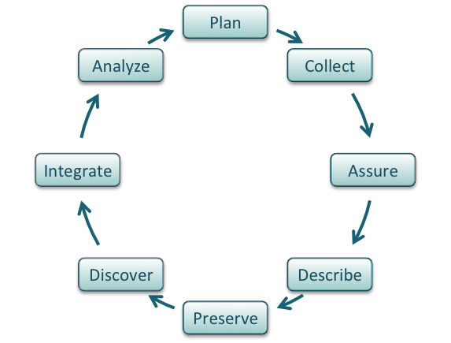
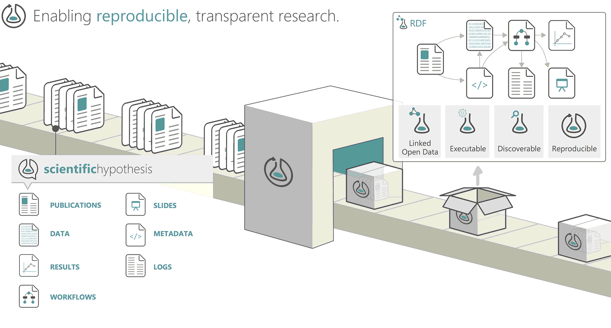
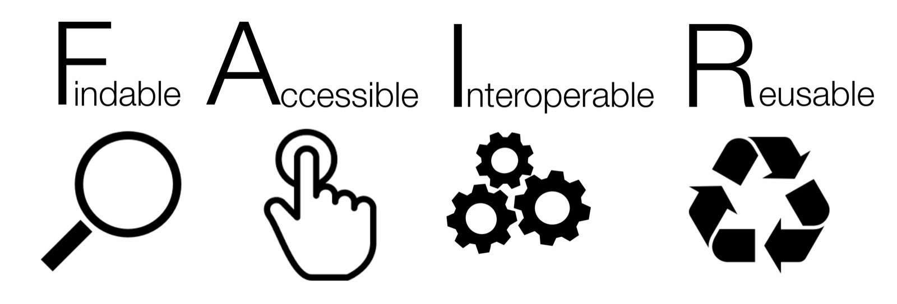

# Lesson 2: Modern Data Management for Computational Research

!!! info "Lesson Overview"
    **Duration:** 50 minutes

    **Structure:**

    - Introduction (5 min)
    - Core Concepts (25 min)
    - Hands-on Activity (15 min)
    - Wrap-up (5 min)

## Learning Objectives

!!! success "After completing this lesson, you will be able to:"
    - Recognize data as the foundation of open science
    - Describe the complete "life cycle of data"
    - Apply FAIR principles to your research data
    - Understand CARE principles for sensitive data
    - Explain why community mirrors and preservation protect environmental-justice data
    - Use self-assessments to evaluate your data management practices
    - Identify tools and resources to improve data management
    - Create a basic data management plan in the 2026 NIH format and explain how the NSF Data Management and Sharing Plan differs
    - Choose appropriate licenses for your data

---

## Introduction (5 minutes)

### The Hidden Crisis in Research

!!! question "Critical Questions"
    - If you gave your data to a colleague unfamiliar with your project, could they make sense of it?
    - If you returned to your own data in five years, would you understand it?
    - When publishing, can you easily find all correct versions of your data?

!!! example "SRP Research Scenario"
    Imagine a collaborator asks you to share:

    - Arsenic concentration measurements from 50 mine tailings samples
    - Lung tissue images from an inhalation exposure study
    - Plant biomass and metal uptake data from phytoremediation field plots
    - GPS coordinates and soil characterization from multiple Superfund sites
    - Uranium, arsenic, and vanadium (U/As/V) water and soil chemistry from abandoned uranium mines on Navajo Nation
    - Livestock and household well-water screening results from partner communities
    - Community survey data collected under Navajo Nation Human Research Review Board (NNHRRB) approval

    Could they understand your file naming conventions? Would they know which samples came from which sites? Would they understand the units, detection limits, and quality control procedures? Would they know which records may never leave the community that owns them? Environmental health research generates complex, multi-dimensional datasets requiring exceptional organization.

### The Biggest Challenge

!!! danger "The #1 Data Management Problem"
    **Making it an afterthought.**

    Poor data management has no upfront cost. You can do substantial work before realizing you are in trouble. By then, fixing the problem is exponentially harder.

    **The solution?** Make data management the **first** thing you consider when starting research.

### Why Data Management Matters

**Well-managed datasets:**

- Make life much easier for you and collaborators
- Enable others to reuse and build upon your work
- Are increasingly **required** by funders and journals
- Protect against data loss and irreproducibility
- Save time and prevent costly errors

!!! danger "When the data disappear: EJScreen and data rescue (2025)"
    Environmental-justice data are only as durable as the servers they live on.

    - **21 Jan – 11 Feb 2025** - 203 CDC datasets were removed from public sites; a court order in *Doctors for America v. OPM* (11 Feb 2025) required their restoration ([case record](https://clearinghouse.net/case/46029/){target=_blank})
    - **5 Feb 2025** - EPA removed EJScreen, its environmental-justice screening tool ([EDGI](https://envirodatagov.org/epa-removes-ejscreen-from-its-website/){target=_blank}; [Harvard EELP tracker](https://eelp.law.harvard.edu/tracker/epa-added-environmental-health-indicators-to-ejscreen/){target=_blank})
    - **7 Feb 2025** - the Public Environmental Data Partners mirror of [EJScreen](https://screening-tools.com/epa-ejscreen){target=_blank} went live; **14 Feb 2025** the [EJAM](https://screening-tools.com/epa-ejam){target=_blank} mirror followed (version 3 in 2026)
    - **6 Feb 2025** - Harvard Library Innovation Lab announced its [data.gov archive](https://lil.law.harvard.edu/blog/2025/02/06/announcing-data-gov-archive/){target=_blank}, now 311,000+ datasets and 16 TB on [Source Cooperative](https://source.coop/repositories/harvard-lil/gov-data/description){target=_blank} (updated July 2026); the [Data Rescue Project](https://www.datarescueproject.org/){target=_blank} launched the same month
    - **13 Mar 2026** - *Sierra Club v. EPA* was dismissed for lack of standing; EJScreen is still absent from epa.gov

    **The lesson:** download, DOI, and document what you depend on. Keep a dated local copy of every federal dataset your project uses, record its version and source URL, and cite the persistent identifier of the copy you actually analyzed.

    **Ask yourself:** Which federal datasets does your project depend on? Where is your copy?

!!! info "NSF (PAPPG 24-1 + Supplements 26-200/26-202)"
    The [NSF Proposal and Award Policies and Procedures Guide 24-1](https://www.nsf.gov/policies/pappg){target=_blank} remains in force, with two supplements that change what your plan must promise:

    - **Supplement 1 (NSF 26-200, 8 Dec 2025)** - data underlying publications must be shared at the time of publication ([details](https://www.nsf.gov/policies/document/pappg24-1-supplement-1){target=_blank})
    - **Supplement 2 (NSF 26-202, 22 Jan 2026)** - the DMP is now a **Data Management and Sharing Plan** (2 pages), submitted through a Research.gov webform since 27 Apr 2026, and must commit to persistent identifiers and minimum metadata ([details](https://www.nsf.gov/policies/document/pappg24-1-supplement-2){target=_blank})
    - A successor guide (GFA 27-1) has been proposed for FY2027; check the [NSF data management plan page](https://www.nsf.gov/funding/data-management-plan){target=_blank} before you submit

!!! info "NIH DMS Policy: the 2026 format"
    The [NIH Data Management and Sharing Policy](https://grants.nih.gov/policy-and-compliance/policy-topics/sharing-policies/dms){target=_blank} itself is unchanged, but the plan you write is not:

    - **[NOT-OD-26-046](https://grants.nih.gov/grants/guide/notice-files/NOT-OD-26-046.html){target=_blank}** - for due dates on or after 25 May 2026, plans use a pilot [format page](https://grants.nih.gov/grants-process/write-application/forms-directory/data-management-and-sharing-plan-format-page){target=_blank}: a set of **Yes/No commitments**, a justification of up to **300 words** for any limitation on sharing, and a **100-word table** of data types and repositories (details under Data Management Plans below)
    - **[NOT-OD-26-100](https://grants.nih.gov/grants/guide/notice-files/NOT-OD-26-100.html){target=_blank}** - no prior approval is needed to change a plan; compliance is reported in RPPR section C.5.c starting 1 Oct 2026; all awards move to the 2026 format in FY2027
    - **Gold Standard Science** - NIH's implementation plan (22 Aug 2025) adds data-sharing compliance, replication, and training to its tenets ([NIH OSP](https://osp.od.nih.gov/nih-releases-implementation-plan-to-drive-gold-standard-science/){target=_blank}); the executive order itself is covered in [Lesson 1](01-open-science.md)
    - **Superfund Research Program** - a Data Management and Analysis Core (DMAC) has been mandatory for P42 centers since RFA-ES-23-001, RFA-ES-27-004 (due 25 Sep 2026) continues the requirement, and 19 DMACs are currently active ([SRP data sharing](https://tools.niehs.nih.gov/srp/data/index.cfm){target=_blank}, [DMAC pages](https://tools.niehs.nih.gov/srp/data/dmac.cfm){target=_blank}, [NIEHS data policy](https://www.niehs.nih.gov/research/scientific-data/policy){target=_blank})
    - Human subjects protections for community health data and documented restrictions on sensitive data (contaminated-site locations, participant privacy, tribally governed data) still apply

---

## Core Concepts (25 minutes)

### What Qualifies as Data?

Different data types require different management strategies:

**Data Types:**

- **Text** - Field notes, survey responses, interview transcripts
- **Numeric** - Tables, measurements, counts, statistics
- **Audiovisual** - Images, videos, sound recordings
- **Models & Code** - Simulations, algorithms, analysis scripts
- **Discipline-specific** - FASTA (biology), FITS (astronomy), CIF (chemistry)
- **Instrument-specific** - Raw equipment outputs, sensor readings

!!! example "SRP Data Types"
    **Environmental Chemistry (Arizona)** - ICP-MS outputs (arsenic/metalloid concentrations), XRD patterns, synchrotron XAS spectra

    **Metal mixtures (UNM METALS)** - ICP-MS/ICP-OES concentrations of U/As/V, gamma spectrometry of soil cores, XANES speciation of uranium and vanadium phases in mine waste

    **Toxicology** - Flow cytometry data, histopathology images, gene expression arrays, biomarker measurements

    **Phytoremediation** - Plant biomass measurements, metal uptake data, hyperspectral imaging, LiDAR point clouds

    **Epidemiology** - Survey responses (with PII protections), biomarker data (HIPAA-compliant), geospatial health data

    **Community exposure** - Household well water, dust wipes, urine biomonitoring, collected with partner communities under tribal data-governance conditions

    **Field Sampling** - GPS coordinates, soil cores, air quality measurements, meteorological data

**Data Sources:**

=== "Observational"
    - Captured in real-time, typically outside lab
    - **Usually irreplaceable** - most important to safeguard
    - Examples: Sensor readings, telescope observations, field surveys

=== "Experimental"
    - Generated under controlled conditions
    - Often reproducible but expensive/time-consuming
    - Examples: Lab measurements, controlled trials, sequencing

=== "Simulation"
    - Machine-generated from computational models
    - Reproducible if model and inputs preserved
    - Examples: Climate projections, molecular dynamics

=== "Derived"
    - Generated from existing datasets
    - Reproducible but potentially expensive
    - Examples: Meta-analyses, compiled databases, data mining results

### The Data Life Cycle

<figure markdown>
  { width="500" }
  <figcaption>Data flow through multiple stages, each with specific management needs</figcaption>
</figure>

Understanding where data are in their lifecycle helps plan management strategies:

#### :material-lightbulb: Plan

- Describe data to be collected
- Plan for organization before collection
- Consider all lifecycle stages
- Create Data Management Plan

!!! tip "Planning Questions"
    - What data will you generate or reuse?
    - What file formats will you use?
    - How will you organize and document data?
    - Where will data be stored and backed up?
    - How will you ensure data quality?
    - Who will have access and when?
    - How long must data be preserved?

#### :material-clipboard-check: Collect

- Implement organizational system before collecting
- Capture observation metadata simultaneously
- Take advantage of automatic metadata generation
- Use consistent naming conventions
- Document collection conditions

!!! example "File Naming Best Practices"
    ```
    # Good Examples
    2026-01-15_site-A_temp-sensor-01_raw.csv
    experiment-03_rep-02_treated_microscopy.tif
    survey_2026_wave-01_demographics.xlsx

    # Bad Examples
    data.csv
    final_FINAL_v3_revised_2.xlsx
    New Folder (2)/results!!!.csv
    ```

!!! example "SRP File Naming Examples"
    ```
    # Mine Tailings Samples (Arizona)
    2026-04-18_IronKing_MT-014_As-concentration_ICP-MS.csv
    2026-04-18_IronKing_MT-014_XRD-pattern_raw.xy

    # Abandoned Uranium Mines (Navajo Nation, UNM METALS)
    2026-03-12_RWPR_WELL-07_U-As-V_ICP-MS.csv
    2026-05-02_ClaimTwentyEight_soil-core-03_gamma-spec.csv

    # Lung Tissue Images
    exp-027_mouse-14_lung-section-03_H&E-stain_40x.tif
    exp-027_mouse-14_lung-section-03_collagen-IF_20x.tif

    # Phytoremediation Field Data
    2026-03-15_site-B_plot-12_Atriplex-canescens_biomass.csv
    2026-03-15_site-B_hyperspectral_processed_NDVI.tif

    # Keep consistent: YYYY-MM-DD_site_sample-ID_analysis-type_details.ext
    # Rule: site codes in filenames, never GPS coordinates or household IDs
    ```

#### :material-quality-high: Assure

- Record quality conditions during collection
- Distinguish estimated from measured values
- Double-check manually entered data
- Run statistical summaries to find outliers
- Flag questionable or missing values
- Perform validation checks

**Quality Assurance Checklist:**

- [ ] Define acceptable ranges for measurements
- [ ] Implement automated validation scripts
- [ ] Document calibration procedures
- [ ] Track instrument performance over time
- [ ] Create visualizations to spot anomalies
- [ ] Maintain audit trail of quality checks

#### :material-text-box: Describe

!!! quote "Metadata is Key"
    "Without thorough description of context, collection methods, measurements, and quality, data are unlikely to be discovered, understood, or effectively used."

**Essential Metadata:**

- **Dataset information** - Title, dates, version, related datasets
- **People** - Authors, affiliations, sponsors, ORCID IDs
- **Scientific context** - Research question, hypotheses, methods
- **Data details** - Variables, units, formats, missing value codes
- **Quality** - Precision, accuracy, uncertainty, QA procedures
- **Access** - License, restrictions, citation instructions

**Metadata Standards:**

- [DataCite](https://schema.datacite.org/){target=_blank} - Publishing data (schema 4.7, March 2026)
- [Dublin Core](https://www.dublincore.org/){target=_blank} - Web-based sharing
- [ISO 19115-1](https://www.iso.org/standard/53798.html){target=_blank} - Geospatial data
- [MIxS](https://genomicsstandardsconsortium.github.io/mixs/){target=_blank} - Environmental samples (v7: soil, water, sediment)
- [Darwin Core](https://dwc.tdwg.org/){target=_blank} - Biodiversity/ecological data
- [Environmental Health Language Collaborative (EHLC)](https://www.niehs.nih.gov/research/programs/ehlc){target=_blank} - Harmonized vocabularies for environmental health
- [GA4GH Human Exposome Data Standards](https://www.ga4gh.org/product/human-exposome-data-standards/){target=_blank} - Exposure and biomonitoring data
- [Croissant 1.1](https://mlcommons.org/working-groups/data/croissant/){target=_blank} and [Frictionless](https://frictionlessdata.io/){target=_blank} - Machine-readable table descriptions (ML-ready datasets)
- Domain-specific standards - Check [FAIRsharing.org](https://fairsharing.org/){target=_blank}

!!! example "SRP Metadata Needs"
    **Mine Tailings Samples** - Site GPS coordinates, collection date/time, depth, weather conditions, proximity to mining activity, historical context, chain of custody

    **Abandoned Uranium Mine Samples (UNM METALS)** - Mine and claim identifier, distance to homes and wells, chapter or pueblo jurisdiction, sampling permit, radiological screening at collection

    **Toxicology Experiments** - Animal strain/source, exposure protocol (concentration, duration, route), housing conditions, institutional approvals (IACUC), treatment randomization

    **Chemical Analysis** - Instrument make/model, calibration standards, detection limits, QA/QC procedures, analyst ID, date of analysis, method references

    **Field Studies** - Plot layout, vegetation surveys, soil characterization, meteorological data, disturbance history, GPS accuracy

    **Community Data** - Consent scope, NNHRRB protocol number, chapter resolution, Local Contexts TK/BC Notice, embargo and ownership terms, who must approve release

#### :material-archive: Preserve

!!! warning "Not Just Backup - Preservation"
    Preservation means ensuring data remain accessible and usable long-term, not just keeping copies on a hard drive.

**Preservation Repositories:**

- **Institutional (Arizona)** - [UA ReDATA](https://redata.arizona.edu/){target=_blank}
- **Institutional (New Mexico)** - [UNM Digital Repository](https://digitalrepository.unm.edu/){target=_blank}; UNM is a [Dryad](https://datadryad.org/){target=_blank} member (up to 300 GB per dataset, no fee); the [UNM Research Data Services guide](https://libguides.unm.edu/data){target=_blank} covers the 2026 NIH and NSF templates
- **Environmental/Health** - [NIEHS CEBS](https://cebs-ext.niehs.nih.gov/datasets/){target=_blank}, [SRP Tox Data Commons](https://toxdatacommons.com/){target=_blank}, [NEU Data Dictionaries](https://manati.ece.neu.edu/dictionary/){target=_blank}, [EPA Science Inventory](https://cfpub.epa.gov/si/){target=_blank} and [Environmental Dataset Gateway](https://edg.epa.gov/){target=_blank}
- **Ecological/Earth science** - [EDI](https://edirepository.org/){target=_blank}, [DataONE](https://www.dataone.org/){target=_blank}, [PANGAEA](https://pangaea.de/){target=_blank}, [USGS ScienceBase](https://www.sciencebase.gov/){target=_blank} (USGS authors only)
- **Human subjects** - [dbGaP](https://dbgap.ncbi.nlm.nih.gov/home){target=_blank} (controlled access)
- **General purpose** - [Zenodo](https://zenodo.org/){target=_blank} (50 GB per record), [Figshare](https://figshare.com/){target=_blank} (20 GB free)
- **CyVerse** - [Data Commons](https://datacommons.cyverse.org/){target=_blank} for computational biology

!!! example "SRP Repository Choices"
    **Toxicology Data** - NIEHS CEBS or the SRP Tox Data Commons; dbGaP for human subjects data; Figshare or Zenodo for animal studies

    **Environmental Chemistry (Arizona mine tailings)** - EPA Science Inventory or Environmental Dataset Gateway for arsenic data from contaminated sites, or Zenodo with appropriate environmental keywords

    **Geospatial Data** - DataONE or EDI for mine site characterization and remediation monitoring data; USGS ScienceBase only with a USGS co-author

    **Spectroscopy Data** - Zenodo allows large files and assigns DOIs, suited to synchrotron XAS, XANES, or hyperspectral datasets

    **Tribal community data (UNM METALS)** - the [Native BioData Consortium](https://nativebio.org/){target=_blank} Tribal Data Repository or tribally controlled storage; a metadata-only record elsewhere (institutional repository, DataCite) so the dataset is findable without leaving the community's control

<figure markdown>
  { width="500" }
  <figcaption>RO-Crate 1.3 (June 2026) packages data, code, and metadata as one citable research object</figcaption>
</figure>

Package before you deposit: an [RO-Crate](https://www.researchobject.org/ro-crate/){target=_blank} bundles the files, their metadata, and the workflow that produced them, so a reviewer gets the whole research object rather than a bare folder; the same idea applies to software under [FAIR4RS](https://www.nature.com/articles/s41597-022-01710-x){target=_blank}.

**Preservation Best Practices:**

1. Choose repositories with [TRUST principles](https://www.nature.com/articles/s41597-020-0486-7){target=_blank}
2. Use open, non-proprietary formats when possible
3. Include comprehensive documentation
4. Assign persistent identifiers (DOIs)
5. Apply appropriate licenses
6. Consider embargo periods if needed

#### :material-magnify: Discover

Good metadata enables discovery by you and others:

- Repository search interfaces, discipline-specific portals, and aggregators such as [re3data](https://www.re3data.org/){target=_blank}
- [Google Dataset Search](https://datasetsearch.research.google.com/){target=_blank}
- [DataONE](https://www.dataone.org/){target=_blank}
- [OpenAlex](https://openalex.org/){target=_blank} - open scholarly index; its November 2025 rewrite ingests DataCite records, so deposited datasets appear next to papers
- [DataCite Commons](https://commons.datacite.org/){target=_blank} - search every DataCite DOI and the people, organizations, and works connected to it

#### :material-link-variant: Integrate

- Data integration requires careful work
- Standards and ontologies are crucial
- Know the data before integrating
- Never assume column headers mean the same thing
- **Always cite data you reuse**
- Use DOIs for citations

#### :material-chart-line: Analyze

- Follow reproducible practices
- Record all software, versions, parameters
- Use computational notebooks (Jupyter, R Markdown, Quarto)
- Version control analysis code
- Pre-register analysis plans when possible
- Document decision points

### FAIR Principles

In 2016, the [FAIR Guiding Principles](https://www.nature.com/articles/sdata201618){target=_blank} revolutionized how we think about data management.

<figure markdown>
  { width="500" }
  <figcaption>FAIR Principles provide a framework for data stewardship</figcaption>
</figure>

!!! tip "Why Principles, Not Rules?"
    FAIR is intentionally a set of principles, not rigid rules. Different disciplines must interpret and implement these principles appropriate to their contexts and technologies.

#### F - Findable

- (Meta)data assigned globally unique persistent identifier
- Data described with rich metadata
- Metadata includes identifier of described data
- (Meta)data registered in searchable resource

**Practical Implementation:**

- Use DOIs for datasets
- Create comprehensive README files
- Register with domain repositories
- Use descriptive, searchable keywords

#### A - Accessible

- (Meta)data retrievable via standardized protocol
- Protocol is open, free, universally implementable
- Protocol allows authentication when necessary
- Metadata accessible even when data unavailable

**Practical Implementation:**

- Store in repositories with standard access protocols (HTTPS, S3)
- Provide clear access instructions
- Maintain metadata permanently
- Document access restrictions clearly

#### I - Interoperable

- (Meta)data use formal, shared, broad language
- (Meta)data use vocabularies following FAIR principles
- (Meta)data include qualified references to other data

**Practical Implementation:**

- Use standard file formats (CSV, NetCDF, GeoTIFF)
- Prefer cloud-native formats for large data: GeoParquet for vector tables, Cloud-Optimized GeoTIFF (COG) for rasters, Zarr for arrays, and DuckDB over Parquet for local analysis
- Apply community ontologies
- Link related datasets
- Document relationships between datasets

#### R - Reusable

- (Meta)data richly described with accurate attributes
- Released with clear, accessible usage license
- Associated with detailed provenance
- Meet domain-relevant community standards

**Practical Implementation:**

- Include comprehensive documentation
- Apply recognized license (CC-BY, CC0)
- Document data collection and processing
- Follow discipline-specific standards

!!! warning "FAIR ≠ Open"
    FAIR does not require data be open. Data can be FAIR but restricted:

    - Human subjects data may be FAIR but require access approval
    - Endangered species locations should be findable in metadata but not accessible
    - Data collected on Navajo Nation may be FAIR to the Nation and its chapters while access for everyone else is governed by NNHRRB conditions, with a metadata-only record in public repositories

### CARE Principles

!!! quote "Nothing About Us Without Us"
    The [CARE Principles](https://www.gida-global.org/careprinciples){target=_blank} for Indigenous Data Governance ensure Indigenous Peoples' rights and interests in data are respected. CARE complements FAIR by centering Indigenous rights and interests in data governance: FAIR asks whether data *can* be reused, CARE asks whether they *should* be, by whom, and on whose terms.

**C - Collective Benefit**

- Data for inclusive development and innovation
- Data for improved governance and citizen engagement
- Data for equitable outcomes

**A - Authority to Control**

- Recognize Indigenous rights and interests
- Empower data for governance
- Support governance of data

**R - Responsibility**

- Foster positive relationships
- Expand capability and capacity
- Support Indigenous languages and worldviews

**E - Ethics**

- Minimize harm and maximize benefit
- Promote justice
- Consider future use

!!! warning "Research on Navajo Nation"
    UNM METALS ("Metal Exposure and Toxicity Assessment on Tribal Lands in the Southwest", 2022–2027) partners with the Pueblo of Laguna (Jackpile Mine) and the Navajo communities of Red Water Pond Road, Blue Gap-Tachee, and Cameron ([METALS Center](https://hsc.unm.edu/pharmacy/research/areas/metals/){target=_blank}); Arizona mine sites may also lie on or near tribal lands. For work on Navajo Nation:

    - The [Navajo Nation Human Research Review Board](http://nnhrrb.navajo-nsn.gov/){target=_blank} (NNHRRB, established 1996) must approve the protocol, and the affected chapter must pass a supporting resolution, **before** collection begins
    - **The Navajo Nation owns the data.** The NNHRRB must approve the Final Report and a Dissemination Plan before results are shared in any form, including preprints, conference talks, and repository deposits
    - The 2024 Navajo Nation Genetics Research Policy Statement ([Legislation 0241-24](https://www.navajonationcouncil.org/wp-content/uploads/2024/11/0241-24.pdf){target=_blank}) governs genetic and biospecimen research
    - UNM investigators follow the [UNM HRPO](https://hsc.unm.edu/research/compliance/hrpo/){target=_blank} and the [UNM IRB guidance for research with American Indian communities](https://irb.unm.edu/library/documents/guidance/research-with-american-indian-communities.pdf){target=_blank}, which also covers the Southwest Tribal IRB, the IHS IRB, and approval by Pueblo governors (for the Pueblo of Laguna)
    - Tribal nations near Arizona sites each have their own review process; a university IRB approval is never a substitute

    Write these conditions into the DMP, the metadata, and the data governance agreement, not just the IRB file.

!!! tip "Applying CARE in Practice"
    When working with data about Indigenous peoples, traditional knowledge, or Indigenous lands:

    1. Engage with communities early
    2. Establish data sovereignty agreements
    3. Respect cultural protocols
    4. Share benefits equitably
    5. Support community capacity building
    6. Label data with [Local Contexts](https://localcontexts.org/){target=_blank} TK and BC Notices (create a Hub account; read their "Data Do's and Don'ts")
    7. Learn from the [Collaboratory for Indigenous Data Governance](https://indigenousdatalab.org/){target=_blank}, the [Native BioData Consortium](https://nativebio.org/){target=_blank}, and the [US Indigenous Data Sovereignty Network](https://usindigenousdatanetwork.org/){target=_blank}

### Data Management Plans

!!! quote "Failure to Plan is Planning to Fail"
    A Data Management Plan (DMP) is a formal document outlining how data will be handled during and after a research project.

**Why Create a DMP?**

**Stick:** You have to - funders require them

**Carrot:** They make your life easier

- Clarify your thinking before starting
- Anticipate and avoid problems
- Budget appropriately
- Enable collaboration
- Facilitate data sharing and preservation

**Essential DMP Components:**

1. **Data Description**
   - Types, volumes, formats
   - Existing vs. new data
   - Relationship to other data

2. **Metadata & Documentation**
   - Standards to be used
   - Tools for documentation
   - Completeness of documentation

3. **Storage & Backup**
   - Short-term storage during project
   - Backup frequency and methods
   - Data security measures

4. **Access & Sharing**
   - Who can access data and when
   - How others can access data
   - Restrictions on sharing

5. **Preservation**
   - Where data will be deposited
   - How long data will be preserved
   - Costs and responsibilities

6. **Ethics & Compliance**
   - Privacy considerations
   - Intellectual property issues
   - Ethical approvals needed

!!! info "The NIH 2026 format, element by element"
    The [2026 format page](https://grants.nih.gov/grants-process/write-application/forms-directory/data-management-and-sharing-plan-format-page){target=_blank} replaces the six-element narrative with three parts:

    1. **Yes/No commitments** - a checklist of sharing commitments; each "No" has to be explained
    2. **Limitation justification (≤ 300 words)** - the only free text; use it for consent scope, tribal data governance, and site-location sensitivity
    3. **Data and repository table (≤ 100 words)** - each data type paired with the repository that will hold it

    **Budget** for the DMAC's time and any repository fees in the proposal budget.

!!! tip "DMP Tools"
    **[DMPTool](https://dmptool.org/){target=_blank}** - Create plans using funder templates; the NIH 2026 template was added 24 Apr 2026 and the NSF Research.gov webform is mirrored

    **[Data Stewardship Wizard](https://ds-wizard.org/){target=_blank}** - Knowledge-based DMP creation

    Both tools provide guidance, templates, and examples to help you write effective DMPs.

### Choosing a License

By default, creative work is under exclusive copyright. To enable reuse, you must license your work.

**Common Data Licenses:**

=== "CC0 Public Domain"
    - Complete surrender of copyright
    - Data freely usable without attribution
    - Most open option
    - Recommended for maximum reuse

=== "CC-BY Attribution"
    - Requires attribution to creator
    - Allows any use with credit
    - Balances openness with recognition
    - Most common for research data

=== "CC-BY-SA Share-Alike"
    - Requires attribution
    - Derivative works must use same license
    - Ensures openness propagates
    - Less commonly used for data

!!! warning "Non-Commercial Restrictions"
    Avoid "NC" (non-commercial) licenses for research data:

    - Ambiguous definition of "commercial"
    - Restricts institutional and infrastructure use
    - Prevents integration with other datasets
    - Limits reproducibility

!!! warning "Tribal community data are not yours to license"
    CC0 and CC-BY are inappropriate for data collected with or about tribal communities. Those data are governed by the research agreement and the community's review board (for Navajo Nation, the NNHRRB); access terms, attribution, and future use are set there, not by a Creative Commons deed. Publish a metadata record with a Local Contexts Notice instead.

**Choosing a License:**

1. Check funder requirements
2. Consider community norms
3. More open = more reuse
4. Document license clearly in repository
5. Include LICENSE file with data

**Resources:**

- [Choose a License](https://choosealicense.com/){target=_blank} (software only)
- [Creative Commons License Chooser](https://creativecommons.org/chooser/){target=_blank}
- [Open Data Commons Licenses](https://opendatacommons.org/licenses/){target=_blank}

---

## Hands-on Activity (15 minutes)

### Data Management Self-Assessment

Evaluate your current practices across multiple dimensions:

!!! question "Assessment: The Three Vs"

    **Volume** - Size and quantity of data

    - [ ] I know the total size of my active research data
    - [ ] I have enough storage for my data
    - [ ] I have a plan for when data exceed current storage
    - [ ] I've budgeted for data storage costs

    **Velocity** - Speed of data generation/analysis

    - [ ] I can keep up with data processing
    - [ ] I have automated workflows for routine tasks
    - [ ] Data are processed in reasonable timeframes
    - [ ] Backlogs are manageable

    **Variety** - Diversity of data types

    - [ ] I use standard file formats when possible
    - [ ] Different data types are organized logically
    - [ ] I have appropriate tools for each data type
    - [ ] Data can be integrated when needed

!!! question "Assessment: FAIR Principles"

    **Findable**

    - [ ] Data have unique identifiers
    - [ ] Metadata are comprehensive
    - [ ] Data are registered in searchable repositories
    - [ ] Identifiers are persistent (DOIs)

    **Accessible**

    - [ ] Data are stored in reliable locations
    - [ ] Access methods are documented
    - [ ] Authentication is appropriate
    - [ ] Metadata will persist long-term

    **Interoperable**

    - [ ] Standard formats are used
    - [ ] Community vocabularies are applied
    - [ ] Related datasets are linked
    - [ ] Data work with analysis tools

    **Reusable**

    - [ ] Clear license is applied
    - [ ] Provenance is documented
    - [ ] Quality is described
    - [ ] Usage guidelines are provided

!!! question "Assessment: Dependency"

    **External data my project cannot do without**

    - [ ] I can list every federal or third-party dataset my analysis depends on
    - [ ] I hold a dated local copy of each, with its version and source URL recorded
    - [ ] Each copy is mirrored somewhere my lab controls (institutional storage, a repository deposit)
    - [ ] I cite the persistent identifier of the copy I analyzed, not just the agency home page
    - [ ] I know which community mirror (PEDP, Harvard LIL, DataLumos) to use if the source goes offline

### Group Exercise: DMP Scenario

Work in small groups on this scenario:

!!! example "Scenario: Metal-mixture exposure across two Superfund sites"
    You are planning a 4-year NIH Superfund-funded study of metal-mixture exposure, with a plan due after 25 May 2026 (so it uses the NIH 2026 format).

    **Site A - Arizona mine tailings (state land)**

    - Soil and tailings samples (100+ samples/year): ICP-MS for arsenic and metal concentrations
    - Plant tissue samples from phytoremediation plots: biomass, metal uptake, tissue distribution
    - Hyperspectral drone imagery (quarterly): plant stress detection and dust-source mapping
    - Weather station data (15-min intervals): temperature, humidity, wind, precipitation
    - GPS/GIS data: site characterization, vegetation mapping

    **Site B - abandoned uranium mine on Navajo Nation**

    - Household well water and livestock water: ICP-MS for U/As/V
    - Household dust wipes and outdoor soil: gamma spectrometry, XANES speciation
    - Urine biomonitoring and a household exposure survey
    - **NNHRRB conditions:** the Nation owns the data; a chapter resolution precedes collection; the NNHRRB approves the Final Report and Dissemination Plan before any release; household locations are never made public

    **Project involves:**

    - 2 SRP centers (Arizona and UNM METALS), an external analytical lab, and a tribal community partner
    - 12 team members (PIs, grad students, technicians, a DMAC data manager, community health representatives)
    - NIH Superfund funding requiring a 2026-format DMS Plan
    - Site A data must be public no later than publication
    - Some Site A location data may need restriction to prevent looting of remediation plants

**Your Task:** Draft key sections of the DMP addressing:

1. **Data types and volumes** - Estimate sizes, formats (ICP-MS output, drone imagery, gamma spectra, survey responses)
2. **Metadata** - What standards apply? (MIxS for soil and water, Darwin Core for plants, ISO 19115-1 for spatial data, GA4GH exposome standards for biomonitoring)
3. **Storage** - During project, where will data live? (Institutional storage, field backups, tribally controlled storage for Site B)
4. **Quality** - How ensure accuracy? (Calibration standards, duplicate samples, QA/QC protocols)
5. **Sharing** - Timeline, repository (EDI? Zenodo? Tox Data Commons? a metadata-only record?), restrictions for sensitive locations
6. **Roles** - Who is responsible for what? (DMAC data manager, PI oversight, institutional compliance, community partner)
7. **Ethical considerations** - Tribal consultation, community benefit, location data sensitivity
8. **Data governance agreement** - Who owns each data type, who approves release, what happens to Site B data when the grant ends

**Discussion Points:**

- Site A data can go to Zenodo or EDI; Site B data stay under tribal control. How do you make Site B findable (a metadata-only record?) without making it accessible?
- How do you answer the NIH 2026 Yes/No commitments honestly when part of the data cannot be shared, and what goes in the 300-word justification?
- What metadata is critical for someone to reuse the arsenic phytoremediation data? For the U/As/V well-water data?
- How do you handle data from an external lab with different formats?

### Individual Action Planning

Choose one improvement to implement this week:

!!! example "Possible Actions"
    - [ ] Create README template for my lab
    - [ ] Set up automated backups
    - [ ] Register for ORCID and start using it
    - [ ] Reorganize one project's file structure
    - [ ] Document one dataset with comprehensive metadata
    - [ ] Choose and apply license to existing dataset
    - [ ] Create data dictionary for current project
    - [ ] Set up version control for analysis code
    - [ ] Download and DOI-cite the federal datasets my project depends on

---

## Wrap-up (5 minutes)

### Key Takeaways

!!! success "Remember These Concepts"
    1. **Plan early** - Data management starts before data collection
    2. **FAIR principles** provide a framework but require interpretation
    3. **CARE principles** emphasize ethics and Indigenous data sovereignty; on Navajo Nation the NNHRRB and the community decide what is shared
    4. **Metadata matters** - Future you (and others) need excellent documentation
    5. **Preserve what you depend on** - federal datasets can vanish; keep and cite your own copy
    6. **The 2026 formats are short** - NIH Yes/No commitments and the NSF 2-page webform reward honest, specific answers
    7. **Tools exist** - DMPTool, repositories, standards can help
    8. **Start small** - One improvement at a time compounds over time

### Self-Assessment Quiz

??? question "What is the biggest challenge in data management?"
    **Making it an afterthought**

    Data management problems are not immediately obvious. You can collect substantial data before realizing organization, documentation, or backup is inadequate. By then, fixing problems is exponentially harder. Make data management the first consideration in any project.

??? question "True or False: FAIR and CARE principles are the same"
    **False**

    FAIR focuses on making data findable, accessible, interoperable, and reusable - primarily technical concerns. CARE addresses Indigenous data governance, emphasizing collective benefit, authority to control, responsibility, and ethics. Both are important but address different aspects of data stewardship.

??? question "True or False: Data available upon request meets Open Data standards"
    **False**

    Open data must be freely accessible in public repositories without requiring individual requests. "Available upon request" creates barriers, does not ensure data persist long-term, and does not meet FAIR findability or accessibility principles.

??? question "Your NIH application is due in October 2026. What does the Data Management and Sharing Plan look like?"
    **The 2026 pilot format from NOT-OD-26-046**

    For due dates on or after 25 May 2026 the plan is a set of Yes/No commitments, a justification of up to 300 words for any limitation on sharing, and a 100-word table of data types and repositories. You no longer need prior approval to change the plan, but from 1 Oct 2026 you report compliance in RPPR section C.5.c.

??? question "EPA removed EJScreen in February 2025. Your exposure analysis used its indicators. What should already be in your project folder?"
    **A dated local copy, its version and source URL, and the persistent identifier you cite**

    Community mirrors (the PEDP EJScreen and EJAM mirrors, the Harvard LIL data.gov archive, the Data Rescue Project) exist because agencies can withdraw datasets without notice. Download what you depend on, deposit or mirror it where your lab controls it, and cite the identifier of the copy you analyzed.

??? question "Your project needs a license allowing others to use your work with attribution. Which do you choose?"
    **CC-BY (Creative Commons Attribution)**

    CC-BY allows anyone to use, modify, and distribute your data as long as they provide appropriate attribution. This balances openness (maximizing reuse) with recognition (ensuring credit to creators). It is the most common license for research data - unless the data are governed by a tribal research agreement, in which case the agreement, not a CC license, sets the terms.

### Looking Ahead

In Lesson 3, we will address ethical considerations in modern research by exploring:

- Bias and discrimination in AI systems
- Responsible use of AI tools and agents in research
- Transparency and accountability
- Best practices for ethical AI integration

### Additional Resources

- [DataONE Best Practices](https://dataoneorg.github.io/Education/bestpractices/){target=_blank}
- [FAIR Principles](https://www.gofair.foundation/fair-principles){target=_blank} and [TRUST Principles](https://www.nature.com/articles/s41597-020-0486-7){target=_blank}
- [CARE Principles](https://www.gida-global.org/careprinciples){target=_blank}
- [DMPTool](https://dmptool.org/){target=_blank}
- [Registry of Research Data Repositories](https://www.re3data.org/){target=_blank}
- More in [Additional resources](../about/resources.md)

---

**Previous:** [← Lesson 1: Open Science](01-open-science.md) | **Next:** [Lesson 3: AI Ethics →](03-ai-ethics.md)

<p class="carc-provenance" markdown>Adapted from [DUST 2025](https://github.com/tyson-swetnam/dust-2025/blob/29027dbda9ca29a123a68d8b4e2ae5dc198f7193/docs/lesson2_data_management/index.md){target=_blank} (last source update 2025-10-29), CC BY 4.0. Spotted a problem? [Open an issue](https://github.com/UNM-CARC/dust-2026/issues){target=_blank}.</p>
